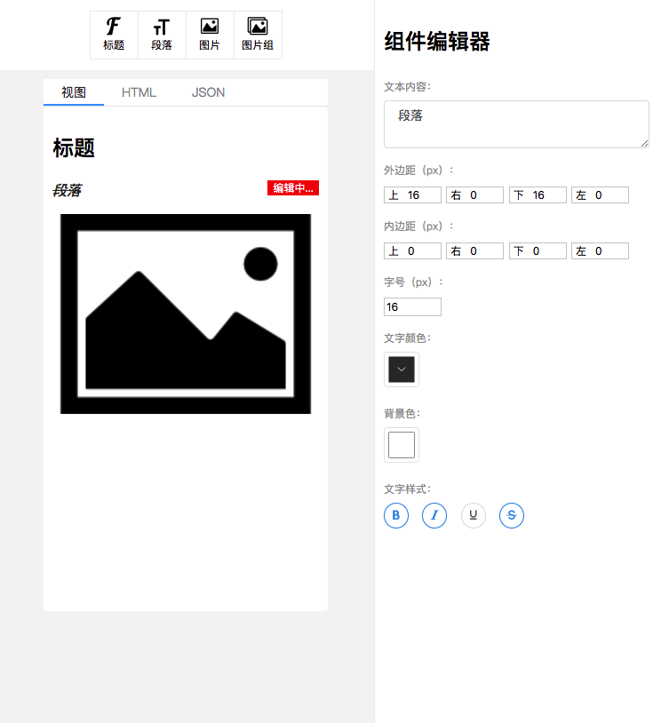

# rick-text

针对微信小程序富文本标签<rich-text>的编辑器，正在构建中

[标签<rich-text>文档](https://developers.weixin.qq.com/miniprogram/dev/component/rich-text.html)

## 编辑器展示

## 规划

- 更多组件，例如：图片列表、链接等
- 支持更多style编辑，例如：padding、font-size、color、backgroud-color、font-weight
- 美化界面样式

